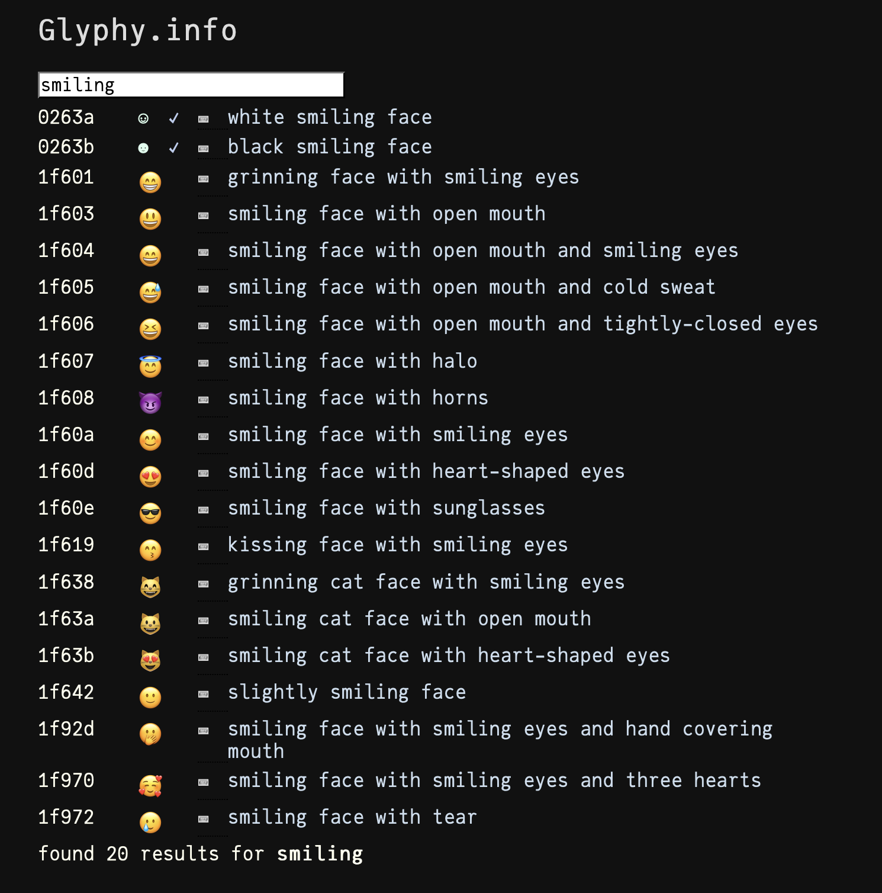

[![][gh-actions-img]][gh-actions-url]


# Glyphy

Glyphy is a small utility package that searches
through the names of glyphs in the Unicode glyph
list and returns a list of the glyph names that
match the search term, and REPL shortcuts if
available.

```julia-term
using Glyphy

julia> glyphy("peacock")

1f99a   🦚       peacock ⌨ \:peacock:
 found one glyph matching "peacock"
``` 

There might be a few:

```julia-term
julia> glyphy("smiling")

0263a   ☺   ✓    white smiling face ⌨ \:relaxed:
0263b   ☻   ✓    black smiling face ⌨ \blacksmiley
1ccaa   𜲪   ✓    lower left quadrant smiling face
1ccab   𜲫   ✓    lower right quadrant smiling face
1f601   😁       grinning face with smiling eyes ⌨ \:grin:
1f603   😃       smiling face with open mouth ⌨ \:smiley:
1f604   😄       smiling face with open mouth and smiling eyes ⌨ \:smile:
1f605   😅       smiling face with open mouth and cold sweat ⌨ \:sweat_smile:
1f606   😆       smiling face with open mouth and tightly-closed eyes ⌨ \:laughing:
1f607   😇       smiling face with halo ⌨ \:innocent:
1f608   😈       smiling face with horns ⌨ \:smiling_imp:
1f60a   😊       smiling face with smiling eyes ⌨ \:blush:
1f60d   😍       smiling face with heart-shaped eyes ⌨ \:heart_eyes:
1f60e   😎       smiling face with sunglasses ⌨ \:sunglasses:
1f619   😙       kissing face with smiling eyes ⌨ \:kissing_smiling_eyes:
1f638   😸       grinning cat face with smiling eyes ⌨ \:smile_cat:
1f63a   😺       smiling cat face with open mouth ⌨ \:smiley_cat:
1f63b   😻       smiling cat face with heart-shaped eyes ⌨ \:heart_eyes_cat:
1f642   🙂       slightly smiling face ⌨ \:slightly_smiling_face:
1f92d   🤭       smiling face with smiling eyes and hand covering mouth ⌨ \:face_with_hand_over_mouth:
1f970   🥰       smiling face with smiling eyes and three hearts ⌨ \:smiling_face_with_3_hearts:
1f972   🥲        smiling face with tear ⌨ \:smiling_face_with_tear:
 found 22 glyphs matching "smiling"
```

Here, the check marks indicate that the glyph is available in
the latest release of the JuliaMono font (it doesn't know
which font you're currently using in your terminal).

Glyphy can also look for the glyph with a specific integer
code point. It's usual to type them as hexadecimal integers,
so `0x2055`, `0x1f638`, etc.

```julia-term
julia> glyphy(0x1f638)

1f638   😸       grinning cat face with smiling eyes ⌨ \:smile_cat:
```

You can look for ranges and arrays of values:

```julia-term
julia> glyphy(0x32:0x7f)

00032   2   ✓    digit two
00033   3   ✓    digit three
00034   4   ✓    digit four
00035   5   ✓    digit five
00036   6   ✓    digit six
00037   7   ✓    digit seven
00038   8   ✓    digit eight
00039   9   ✓    digit nine
...
0007b   {   ✓    left curly bracket
0007c       ✓    vertical line
0007d   }   ✓    right curly bracket
0007e   ~   ✓    tilde
```

```julia-term
julia> glyphy([0x63, 0x2020, 0x2640])

00063   c   ✓    latin small letter c
02020   †   ✓    dagger ⌨ \dagger
02640   ♀   ✓    female sign ⌨ \female
```

```julia-term
julia> glyphy("^z.*")

0200b   ​         zero width space
0200c   ‌         zero width non-joiner
0200d   ‍         zero width joiner
022ff   ⋿   ✓    z notation bag membership ⌨ \bagmember
02981   ⦁   ✓    z notation spot
02982   ⦂   ✓    z notation type colon
02987   ⦇   ✓    z notation left image bracket
02988   ⦈   ✓    z notation right image bracket
02989   ⦉   ✓    z notation left binding bracket
0298a   ⦊   ✓    z notation right binding bracket
02a1f   ⨟   ✓    z notation schema composition ⌨ \bbsemi
02a20   ⨠   ✓    z notation schema piping
...
```

There are over 30,000 characters to search, so searches
might take a few milliseconds...

### Sources

The current version of Unicode is 16.0, released in 2024.
The glyph list used by Glyphy is the file `UnicodeData.txt` from
[here](http://www.unicode.org/Public/UNIDATA/), dated 2024-08-25 18:05.

JuliaMono font (https://github.com/cormullion/juliamono) is at version v0.058, 2024-10-19.

REPL shortcuts are as found in Julia 1.11.

Glyphy is also available as a web service, at [glyphy.info](https://glyphy.info):



[gh-actions-img]: https://github.com/cormullion/Glyphy.jl/workflows/CI/badge.svg
[gh-actions-url]: https://github.com/cormullion/Glyphy.jl/actions?query=workflow%3ACI